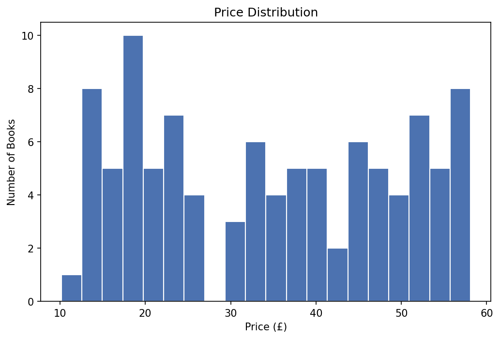
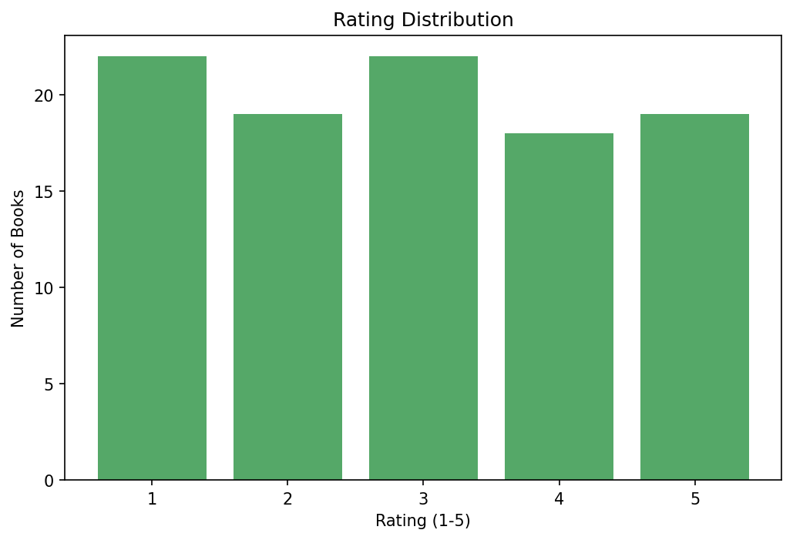
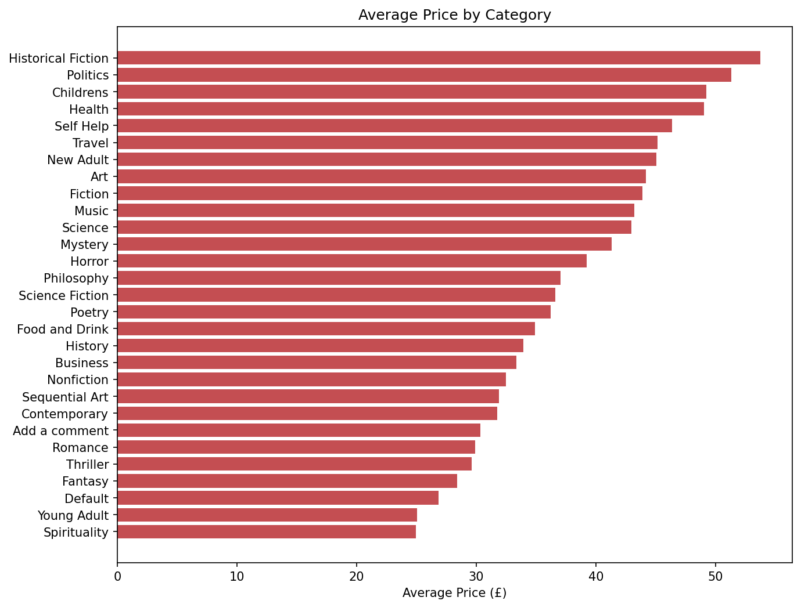
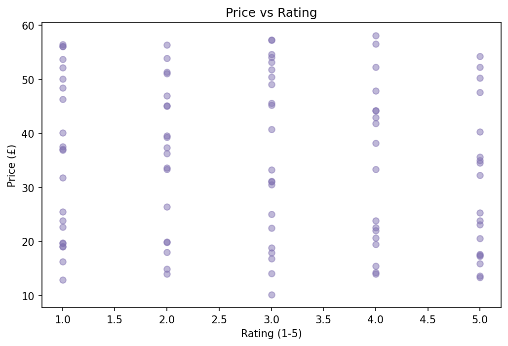
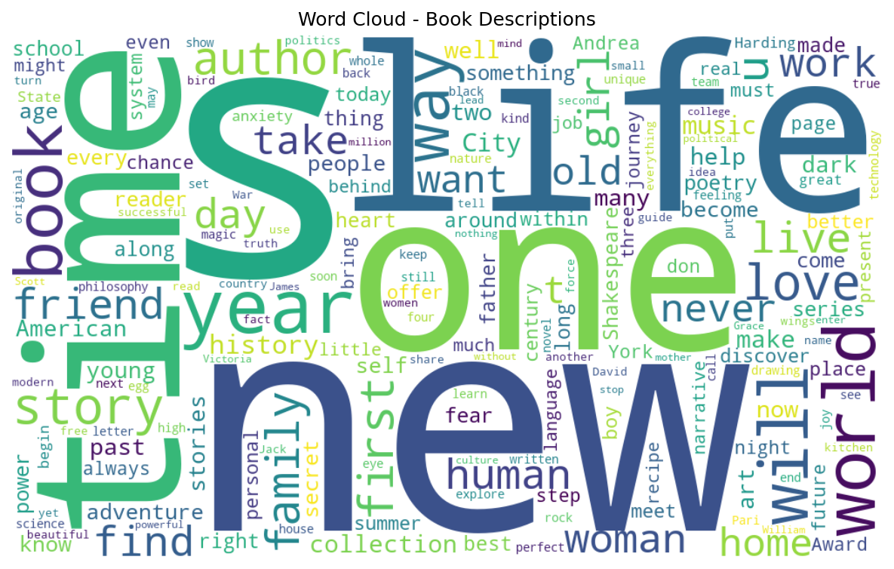

# Project Objectives

- Scrape book information from multiple catalog pages using Scrapy.
- Clean and preprocess the collected dataset.
- Create new engineered features for analysis.
- Generate visualizations to explore the data.
- Interpret the results using summary statistics and graphical analysis.

---

# Dataset

A total of **100 books** were scraped from the first **5 catalog pages**.

The following information was extracted for each book:

- Title
- Category
- Price
- Rating
- Availability
- Product Description
- UPC
- Number of Reviews
- Product URL

---

# Task 1 – Data Scraping

The Scrapy spider performs the following tasks:

- Crawls multiple catalog pages
- Follows pagination automatically
- Visits each individual book page
- Extracts all required fields
- Saves the raw dataset as CSV

The scraping process also reports:

- Total records scraped
- Missing values
- Duplicate UPC values

---

# Task 2 – Data Preprocessing

The preprocessing pipeline performs the following operations:

- Removed duplicate books using UPC
- Cleaned inconsistent text and extra whitespace
- Corrected duplicated product descriptions
- Converted prices to numeric values
- Converted ratings from text to integers
- Extracted available stock count

### Engineered Features

The following additional features were created:

- **description_word_count**
- **price_band**
- **value_score**

The cleaned dataset is stored in:

```text
data/clean/books_clean.csv
```

---

# Task 3 – Visualization and Analysis

The following visualizations were generated:

- Price Distribution
- Rating Distribution
- Average Price by Category
- Price vs Rating (Relationship Plot)
- Word Cloud from Book Descriptions

All generated plots are stored inside the **plots/** directory.

---

## Price Distribution



---

## Rating Distribution



---

## Average Price by Category



---

## Price vs Rating



---

## Description Word Cloud



---

# Summary Statistics

| Metric | Value |
|---------|-------|
| Total Books | **100** |
| Price Range | **£10.16 – £58.11** |
| Average Price | **£34.56** |
| Average Rating | **2.93 / 5** |
| Price vs Rating Correlation | **-0.122** |

---

# Key Insights

1. The dataset contains **100 books** with prices ranging from **£10.16 to £58.11**, and an average price of **£34.56**, showing considerable variation in book pricing.

2. The average book rating is **2.93**, indicating that most books have moderate ratings rather than extremely high or low ratings.

3. The correlation between **price and rating is -0.122**, suggesting that there is little to no relationship between a book's price and its rating.

4. **Historical Fiction** has the highest average price (£53.74), followed by Politics, Childrens, Health, and Self Help.

5. **Spirituality** and **Young Adult** books are the least expensive categories on average.

6. **Sequential Art** is the most represented category in the dataset, followed by Nonfiction and Default.

7. Stock availability is relatively consistent across the dataset, with an average stock count of **17 books**.

---

# Project Structure

```text
bookscraper/
│
├── bookscraper/
│   ├── spiders/
│   └── ...
│
├── data/
│   ├── raw/
│   └── clean/
│       └── books_clean.csv
│
├── plots/
│   ├── avg_price_by_category.png
│   ├── description_wordcloud.png
│   ├── price_distribution.png
│   ├── price_vs_rating.png
│   └── rating_distribution.png
│
├── preprocess.py
├── fix_duplicated_descriptions.py
├── visualize.py
├── report_raw_stats.py
├── scrapy.cfg
├── requirements.txt
└── README.md
```


